# WhatNext Architecture Design Document

## Changelog

| Version | Date       | Author       | Description                              |
|---------|------------|--------------|------------------------------------------|
| v0.1.0  | 2026-02-14 | WhatNext Dev | MVP baseline -- three-process Electron model, RxDB local-first data, libp2p P2P networking, Spotify import adapter |

---

## 1. Introduction

### 1.1 Purpose

This document defines the software architecture of WhatNext, a resilient, user-centric music management platform. It serves as the authoritative reference for how components are structured, how they communicate, and why specific technical decisions were made.

### 1.2 Scope

This architecture covers the MVP (Phase 1: Collaborative Playlist Accessory), including:

- The Electron desktop application and its three-process model
- Local-first data storage with RxDB over IndexedDB (Dexie adapter)
- P2P networking via libp2p for peer discovery and data replication
- Spotify integration as the first import adapter via OAuth PKCE
- The coordinator model for zero-friction collaborative sessions

### 1.3 Architectural Drivers

| Driver                   | Description                                                                 |
|--------------------------|-----------------------------------------------------------------------------|
| User Sovereignty         | Users own their data in local, readable formats. No vendor lock-in.         |
| Local-First              | The local database is canonical. Full functionality without internet.       |
| Decentralized            | P2P collaboration with no central server for core features.                 |
| Platform Abstraction     | Streaming services are interchangeable adapters, not dependencies.          |
| Security-by-Default      | Renderer sandbox enforced, encrypted P2P channels, minimal IPC surface.     |

### 1.4 Related Documents

- [[whtnxt-nextspec]] -- Technical specification (source of truth)
- [[adr-251110-electron-process-model]] -- Three-process architecture decision
- [[adr-251110-libp2p-vs-simple-peer]] -- Why libp2p over simple-peer
- [[adr-251109-database-storage-location]] -- RxDB storage location decision
- [[libp2p]], [[RxDB]], [[RxDB-Replication]], [[Circuit-Relay]], [[Handshake-Protocol]], [[Electron-IPC]], [[WebRTC]], [[Electron]]

---

## 2. Architectural Principles

### 2.1 User Sovereignty

The user's local database is the absolute source of truth. All external services (Spotify, future Apple Music, MusicBrainz) are enhancement layers that feed into the local store. Data is stored in user-accessible formats (RxDB over IndexedDB for runtime, with planned Markdown + YAML frontmatter plaintext export) so users can read, edit, and migrate their data without any WhatNext tooling.

### 2.2 Local-First

WhatNext is fully functional offline. The application reads from and writes to the local RxDB database before any network synchronization occurs. Network connectivity enhances the experience (P2P collaboration, Spotify import) but is never a prerequisite for core functionality.

### 2.3 Decentralized Collaboration

Peer-to-peer networking via libp2p enables collaborative playlist management without routing data through a central server. A helper service exists only for NAT traversal (circuit relay signaling) and OAuth coordination -- never for storing or processing user data.

### 2.4 Platform Abstraction

Streaming platform integrations are implemented as import adapters behind a common interface. The canonical internal data model (RxDB schemas) is platform-agnostic. Spotify is the first adapter; the architecture is designed for Apple Music, YouTube Music, local files, and MusicBrainz adapters to follow.

### 2.5 Security-by-Default

The renderer process runs in a sandboxed Chromium environment with `nodeIntegration: false` and `contextIsolation: true`. All main process communication passes through a preload script that exposes a minimal, explicit API via `contextBridge`. P2P connections use the Noise protocol for encryption. OAuth uses PKCE (no client secret stored).

---

## 3. System Context

The following C4 context diagram shows WhatNext and the external systems it interacts with.

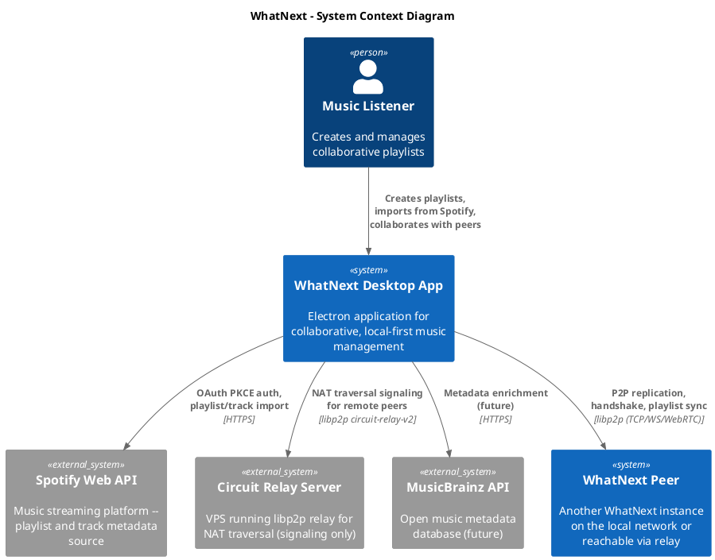

---

## 4. Process Architecture

WhatNext uses a three-process Electron architecture, chosen to isolate the P2P networking stack from both the UI and the main process. See [[adr-251110-electron-process-model]] for the full decision record.

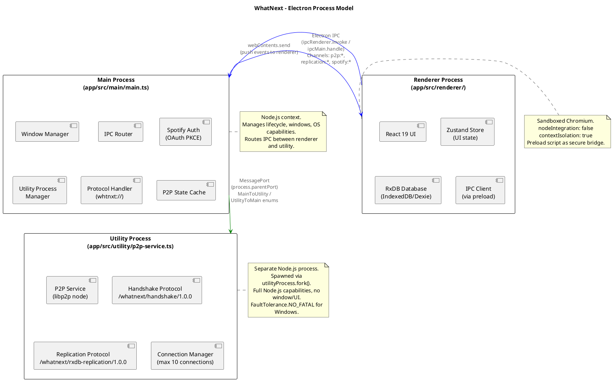

### 4.1 Main Process (`app/src/main/main.ts`)

The main process runs in a Node.js context and is responsible for:

- __Window management__: Creating and configuring `BrowserWindow` instances
- __IPC routing__: Bridging communication between the renderer and utility processes
- __Spotify OAuth__: Handling the PKCE flow (code verifier generation, browser launch, callback processing, token exchange)
- __Utility process lifecycle__: Spawning the P2P utility process via `utilityProcess.fork()`, monitoring its health, relaying messages
- __Protocol URL handling__: Registering and processing `whtnxt://` custom protocol URLs (peer connections and Spotify callbacks)
- __P2P state caching__: Maintaining a `P2PStatusPayload` mirror so the renderer can poll status without round-tripping through the utility process

### 4.2 Renderer Process (`app/src/renderer/`)

The renderer runs React 19 in a sandboxed Chromium environment:

- __React UI__: Component tree for playlists, connections, Spotify import, session views
- __Zustand__: Non-persistent UI state (connection status, active views, UI preferences)
- __RxDB__: Local-first reactive database over IndexedDB via the Dexie adapter. Reactive queries drive UI re-renders.
- __IPC Client__: All main process communication goes through the preload-exposed `window.electron` API

### 4.3 Utility Process (`app/src/utility/p2p-service.ts`)

The utility process is a separate Node.js process spawned by Electron's `utilityProcess.fork()`:

- __libp2p node__: Full P2P networking stack with TCP, WebSockets, WebRTC, and circuit relay transports
- __Protocol handlers__: Handshake and replication protocol implementations
- __Connection management__: Peer discovery via mDNS, connection lifecycle, relay connectivity
- __Communication__: Receives commands from main via `process.parentPort` (MessagePort), sends events back

### 4.4 IPC Message Types

__Main to Utility__ (`MainToUtilityMessageType`):

| Message Type            | Purpose                                    |
|-------------------------|--------------------------------------------|
| `START_NODE`            | Initialize and start the libp2p node       |
| `STOP_NODE`             | Gracefully shut down the libp2p node       |
| `CONNECT_TO_PEER`       | Dial a peer by PeerId (optional relay)     |
| `DISCONNECT_FROM_PEER`  | Hang up connection to a peer               |
| `GET_DISCOVERED_PEERS`  | Request list of mDNS-discovered peers      |
| `GET_CONNECTED_PEERS`   | Request list of currently connected peers  |
| `REPLICATION_PUSH`      | Push RxDB documents to all connected peers |
| `REPLICATION_PULL`      | Pull RxDB documents from connected peers   |

__Utility to Main__ (`UtilityToMainMessageType`):

| Message Type              | Purpose                                       |
|---------------------------|-----------------------------------------------|
| `READY`                   | Utility process initialized, awaiting commands |
| `NODE_STARTED`            | libp2p node running, includes peerId + multiaddrs |
| `NODE_STOPPED`            | Node shut down cleanly                        |
| `NODE_ERROR`              | Fatal or non-fatal error in the P2P layer     |
| `PEER_DISCOVERED`         | New peer found via mDNS                       |
| `PEER_LOST`               | Previously discovered peer no longer visible  |
| `CONNECTION_ESTABLISHED`  | Successfully connected to a peer              |
| `CONNECTION_FAILED`       | Dial attempt failed                           |
| `CONNECTION_CLOSED`       | Peer disconnected                             |
| `CONNECTION_REQUEST`      | Inbound connection request from a peer        |
| `REPLICATION_CHANGES`     | Received replicated documents from a peer     |
| `REPLICATION_STATE`       | Replication sync state update                 |
| `HANDSHAKE_COMPLETE`      | Handshake protocol finished with a peer       |

__Renderer to Main__ (Electron IPC Channels):

| Channel Prefix    | Examples                                  | Direction         |
|-------------------|-------------------------------------------|-------------------|
| `p2p:*`           | `p2p:connect`, `p2p:disconnect`, `p2p:get-status` | Renderer -> Main |
| `p2p:*`           | `p2p:node-started`, `p2p:peer-discovered`, `p2p:connection-established` | Main -> Renderer |
| `replication:*`   | `replication:push`, `replication:pull`     | Renderer -> Main  |
| `replication:*`   | `replication:changes`, `replication:state` | Main -> Renderer  |
| `spotify:*`       | `spotify:auth-start`, `spotify:get-playlists`, `spotify:get-tracks` | Renderer -> Main |
| `spotify:*`       | `spotify:auth-complete`, `spotify:auth-error` | Main -> Renderer |

---

## 5. Component Architecture

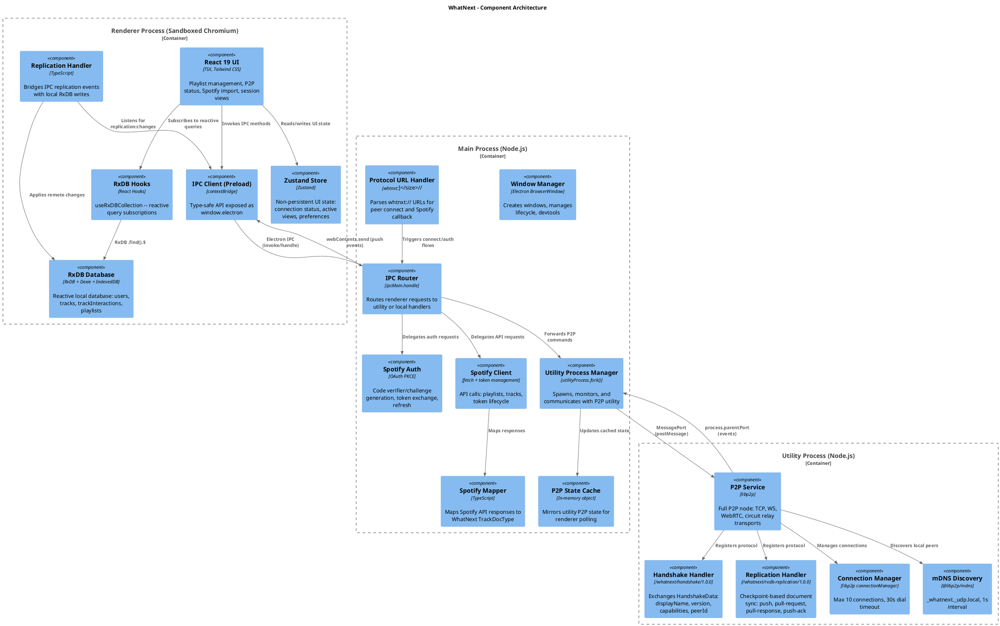

---

## 6. Data Architecture

### 6.1 Storage Layers

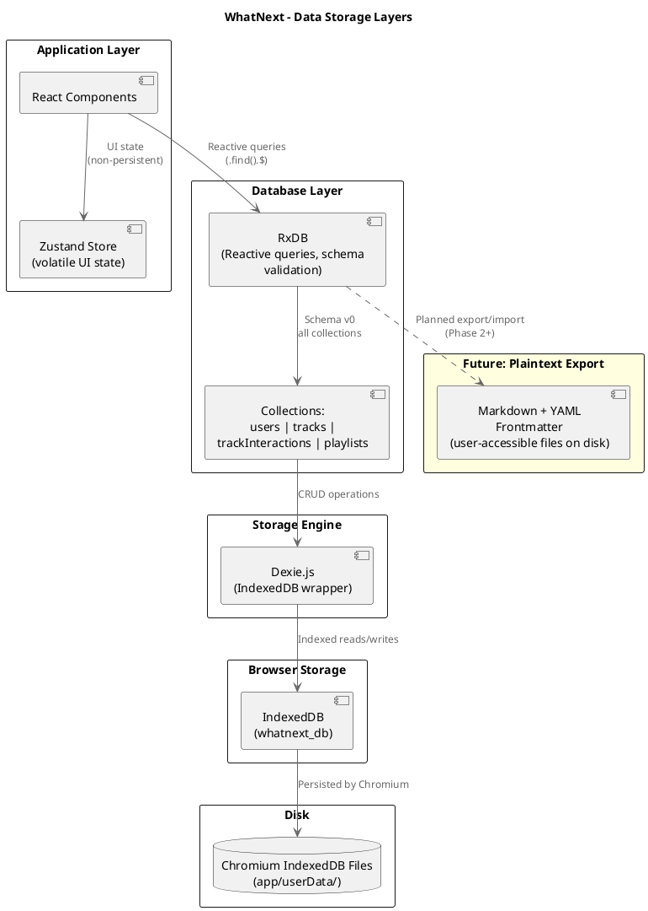

### 6.2 RxDB Schema Summary

All schemas are at version 0. The database name is `whatnext_db`.

__users__ -- Peer identity and status tracking

| Field         | Type    | Required | Indexed | Notes                              |
|---------------|---------|----------|---------|-------------------------------------|
| `id`          | string  | PK       | PK      | Unique peer ID                      |
| `displayName` | string  | Yes      | No      |                                     |
| `avatarUrl`   | string  | No       | No      |                                     |
| `isLocal`     | boolean | Yes      | Yes     | True for the local user             |
| `lastSeenAt`  | string  | Yes      | Yes     | ISO 8601 timestamp                  |
| `publicKey`   | string  | No       | No      | Future encryption/verification      |
| `createdAt`   | string  | Yes      | No      | ISO 8601 timestamp                  |

__tracks__ -- Music tracks with attribution

| Field        | Type     | Required | Indexed | Notes                            |
|--------------|----------|----------|---------|-----------------------------------|
| `id`         | string   | PK       | PK      |                                   |
| `title`      | string   | Yes      | No      |                                   |
| `artists`    | string[] | Yes      | No      | Array of artist names             |
| `album`      | string   | Yes      | No      |                                   |
| `durationMs` | number   | Yes      | No      | Track duration in milliseconds    |
| `spotifyId`  | string   | No       | No      | Optional Spotify track ID         |
| `addedAt`    | string   | Yes      | Yes     | ISO 8601 timestamp                |
| `addedBy`    | string   | Yes      | Yes     | User ID of who added this track   |
| `notes`      | string   | No       | No      | User notes (local user only)      |

__trackInteractions__ -- User-track relationships for social features

| Field            | Type   | Required | Indexed | Notes                                          |
|------------------|--------|----------|---------|-------------------------------------------------|
| `id`             | string | PK       | PK      | Composite: `${userId}_${trackId}_${interactionType}` |
| `userId`         | string | Yes      | Yes     |                                                 |
| `trackId`        | string | Yes      | Yes     |                                                 |
| `playlistId`     | string | No       | No      | Context of the interaction                      |
| `interactionType`| string | Yes      | Yes     | Enum: `vote`, `like`, `skip`, `play`, `queue`   |
| `value`          | number | No       | No      | For votes (+1/-1) or play counts                |
| `createdAt`      | string | Yes      | No      | ISO 8601 timestamp                              |
| `updatedAt`      | string | Yes      | Yes     | ISO 8601 timestamp                              |
| `metadata`       | string | No       | No      | JSON string for extensible data                 |

__playlists__ -- Collaborative playlists with ownership and permissions

| Field              | Type     | Required | Indexed | Notes                                                  |
|--------------------|----------|----------|---------|--------------------------------------------------------|
| `id`               | string   | PK       | PK      |                                                        |
| `playlistName`     | string   | Yes      | No      |                                                        |
| `description`      | string   | No       | No      |                                                        |
| `trackIds`         | string[] | Yes      | No      | Ordered list of track IDs                              |
| `createdAt`        | string   | Yes      | No      | ISO 8601 timestamp                                     |
| `updatedAt`        | string   | Yes      | Yes     | ISO 8601 timestamp                                     |
| `ownerId`          | string   | Yes      | Yes     | User ID of playlist creator                            |
| `collaboratorIds`  | string[] | Yes      | No      | User IDs with write access                             |
| `isCollaborative`  | boolean  | Yes      | Yes     | Whether P2P collaboration is enabled                   |
| `isPublic`         | boolean  | Yes      | No      | Whether discoverable (future)                          |
| `linkedSpotifyId`  | string   | No       | No      | Spotify playlist ID                                    |
| `spotifySyncMode`  | string   | No       | No      | Enum: `accessory`, `true_collaborate`, `proxy_owner`   |
| `tags`             | string[] | Yes      | No      | User-defined tags                                      |
| `queueMode`        | string   | No       | No      | Enum: `free_for_all`, `turn_taking`, `vote_based`      |
| `currentTurnUserId`| string   | No       | No      | For `turn_taking` mode                                 |

> __Note on Dexie indexes__: Optional fields cannot be indexed with the Dexie adapter. This is why `spotifyId` (tracks), `playlistId` (trackInteractions), and `linkedSpotifyId` (playlists) are not indexed despite being useful query targets.

### 6.3 Local Data Flow

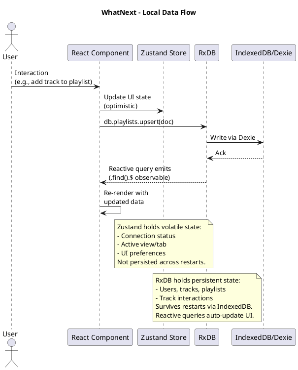

### 6.4 P2P Replication Flow

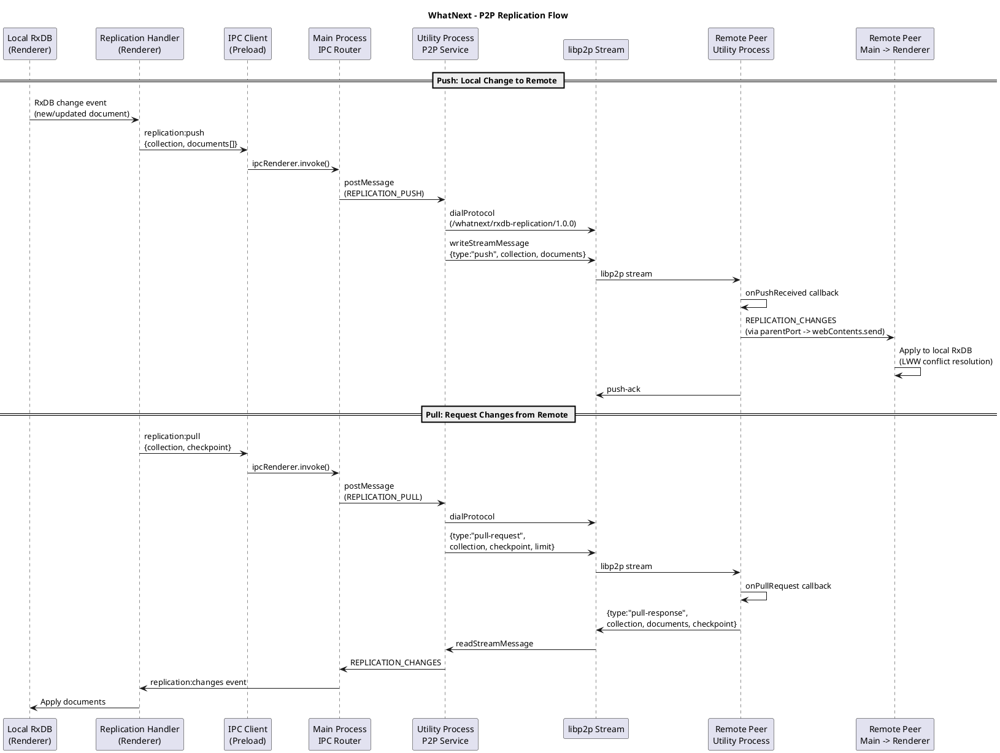

### 6.5 Conflict Resolution

__Current strategy: Last-Write-Wins (LWW)__

Each `ReplicationDocument` carries an `updatedAt` ISO timestamp. When two peers modify the same document concurrently, the document with the later `updatedAt` value wins. This is simple and sufficient for the MVP, where collaborative sessions are typically synchronous.

__Migration path: CRDTs__

The architecture is designed for eventual migration to CRDTs (Conflict-free Replicated Data Types). The replication protocol's checkpoint-based design and per-document sync granularity are compatible with CRDT-based merge functions. The `trackInteractions` collection (votes, likes) is a natural candidate for CRDT counters. Ordered lists (playlist `trackIds`) will require a sequence CRDT (e.g., RGA or LSEQ) for true concurrent editing support.

---

## 7. P2P Networking Architecture

### 7.1 Network Topology

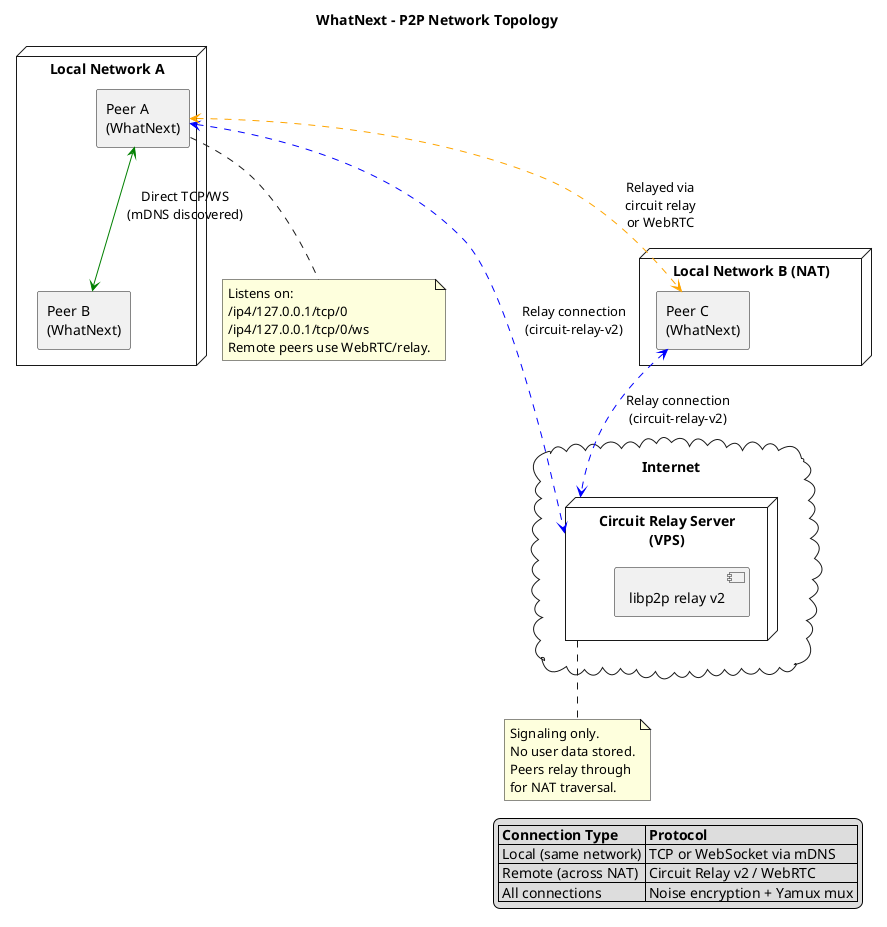

### 7.2 Connection Establishment

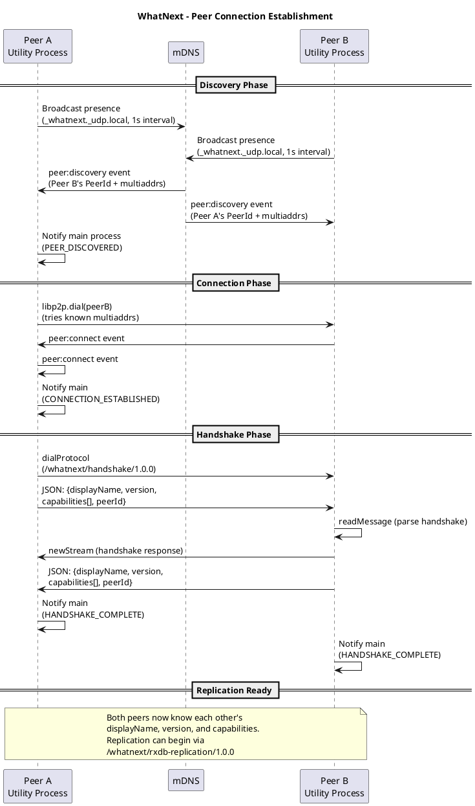

### 7.3 libp2p Stack Configuration

| Layer           | Technology                    | Configuration                                   |
|-----------------|-------------------------------|--------------------------------------------------|
| Transports      | TCP, WebSockets, WebRTC, Circuit Relay v2 | TCP + WS on localhost:0; WebRTC for remote peers |
| Encryption      | Noise protocol                | `@chainsafe/libp2p-noise`                        |
| Multiplexing    | Yamux                         | `@chainsafe/libp2p-yamux`                        |
| Discovery       | mDNS                          | `_whatnext._udp.local`, 1000ms interval          |
| Services        | Identify                      | Required for WebRTC transport                    |
| Connection Mgr  | libp2p built-in               | `maxConnections: 10`                             |
| Fault Tolerance | `FaultTolerance.NO_FATAL`     | Windows Electron utility process compatibility   |

### 7.4 Protocol Specifications

__Handshake Protocol__ (`/whatnext/handshake/1.0.0`)

Exchanged after connection to share peer metadata. Uses JSON-over-stream.

```typescript
interface HandshakeData {
    displayName: string;   // Human-readable peer name
    version: string;       // Protocol version (e.g., "1.0.0")
    capabilities: string[];// Supported features: ["playlist-sync", "rxdb-replication"]
    peerId: string;        // libp2p PeerId as string
}
```

__Replication Protocol__ (`/whatnext/rxdb-replication/1.0.0`)

Checkpoint-based document synchronization. Uses JSON-over-stream with four message types:

```typescript
type ReplicationMessageType = 'pull-request' | 'pull-response' | 'push' | 'push-ack';

interface ReplicationMessage {
    type: ReplicationMessageType;
    collection: string;               // RxDB collection name
    documents?: ReplicationDocument[]; // For push and pull-response
    checkpoint?: string | null;        // ISO timestamp for incremental sync
    limit?: number;                    // Max documents per pull (default: 100)
}

interface ReplicationDocument {
    id: string;
    data: Record<string, unknown>;
    updatedAt: string;  // ISO timestamp (used for LWW resolution)
    deleted?: boolean;  // Soft delete flag
}
```

Message flow:
1. __pull-request__: "Give me documents updated after this checkpoint"
2. __pull-response__: "Here are the documents and the new checkpoint"
3. __push__: "Here are documents I've changed"
4. __push-ack__: "I received your push"

__Playlist Sync Protocol__ (`/whatnext/playlist-sync/1.0.0`) -- Defined in configuration but not yet implemented. Reserved for real-time collaborative queue operations (turn-taking, vote-based ordering).

### 7.5 NAT Traversal Strategy

1. __Local network__: mDNS discovery enables zero-configuration connection between peers on the same subnet. Peers dial directly via TCP or WebSocket.

2. __Remote peers (across NAT)__: Circuit relay v2 provides NAT traversal. The relay server is a lightweight VPS running a libp2p relay node. The relay handles only signaling -- no user data passes through it. Configuration is in `P2P_CONFIG.RELAY` with auto-connect, retry intervals (10s), and max retries (5).

3. __WebRTC__: Available as a transport for browser-to-browser and NAT-punched connections. Requires the identify service and circuit relay transport as dependencies.

---

## 8. Integration Architecture

### 8.1 Import Adapter Pattern

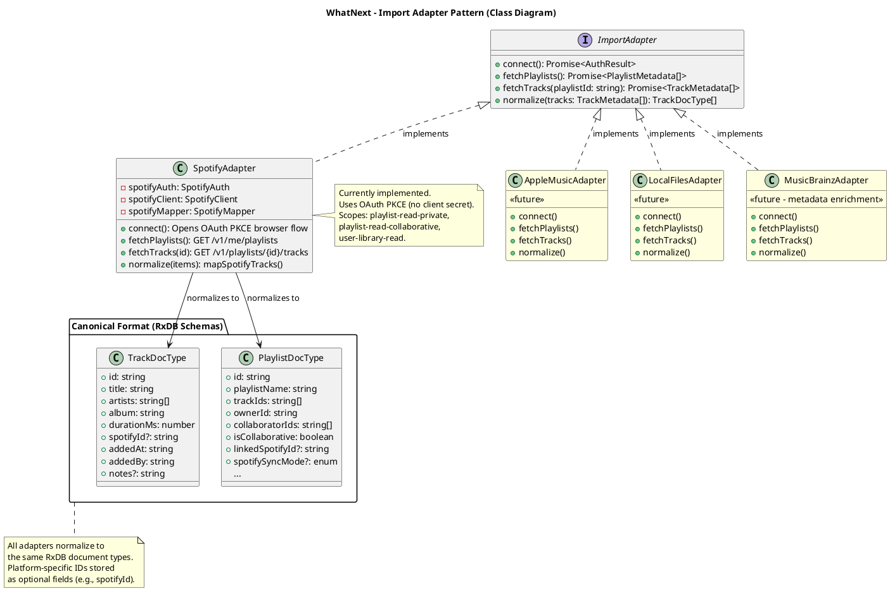

### 8.2 Spotify Import Sequence

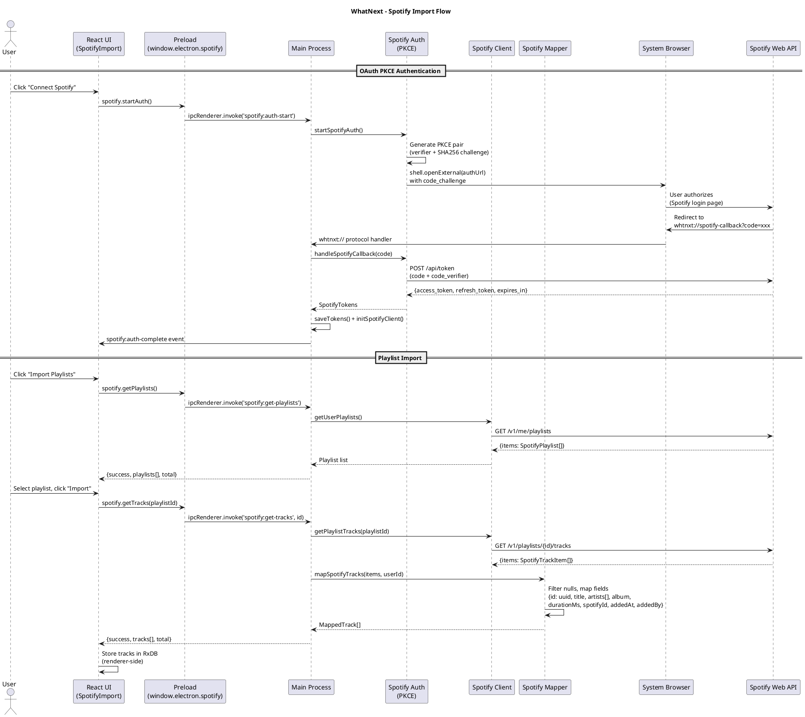

### 8.3 Coordinator Model

The coordinator model enables zero-friction collaborative sessions:

1. __Coordinator connects to source__: The session initiator authenticates with Spotify (only they need OAuth), imports a playlist, and normalizes it to canonical format in RxDB.
2. __Coordinator opens P2P session__: A `whtnxt://connect/<peerId>` link is generated and shared.
3. __Participants join__: Peers connect via the link. No Spotify authentication required for participants -- they receive normalized track data over P2P replication.
4. __Collaboration in WhatNext P2P layer__: All participants can add tracks, vote, and interact. Changes replicate in real-time via the replication protocol.
5. __Optional sync-back__: The coordinator can optionally push changes back to the source platform (Spotify) via the appropriate sync mode (`accessory`, `true_collaborate`, or `proxy_owner` per spec section 8.1).

---

## 9. Deployment Architecture

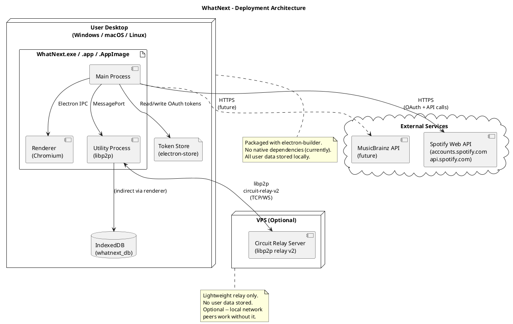

### 9.1 Build and Packaging

| Component       | Build Tool | Output              | Format |
|-----------------|------------|----------------------|--------|
| Main process    | tsup       | `app/dist/main.js`   | CJS    |
| Preload script  | tsup       | `app/dist/preload.js` | CJS   |
| Utility process | tsup       | `app/dist/p2p-service.mjs` | ESM |
| Renderer        | Vite       | `app/dist/` (HTML/JS/CSS) | ESM  |
| Packaging       | electron-builder | Platform-specific installers | --  |

The utility process is built as ESM (`p2p-service.mjs`) because libp2p and its dependencies are ESM-only packages. The main and preload processes use CJS for Electron compatibility.

---

## 10. Security Architecture

### 10.1 Threat Model Summary

| Threat                          | Mitigation                                                      |
|---------------------------------|------------------------------------------------------------------|
| Malicious code in renderer      | Sandbox: `nodeIntegration: false`, `contextIsolation: true`      |
| XSS via external content        | No remote content loaded; external links open in system browser  |
| OAuth token theft                | PKCE flow (no client secret); tokens stored via electron-store   |
| P2P eavesdropping               | All libp2p connections encrypted with Noise protocol             |
| Malicious peer data             | Schema validation in RxDB (AJV in dev mode); message type checking |
| Renderer window hijacking       | `setWindowOpenHandler` returns `{ action: 'deny' }` globally     |
| Protocol URL injection          | `parseProtocolUrl()` validates scheme, action, and PeerId format |
| Utility process crash           | Exit handler notifies renderer; does not crash main process      |

### 10.2 Renderer Sandbox

The renderer process operates under strict security constraints:

```typescript
webPreferences: {
    nodeIntegration: false,    // No Node.js APIs in renderer
    contextIsolation: true,    // Separate JS contexts for preload and renderer
    preload: preloadPath,      // Explicit preload script path
}
```

The preload script (`app/src/main/preload.ts`) exposes a minimal, typed API via `contextBridge.exposeInMainWorld('electron', electronHandler)`. The renderer accesses this as `window.electron`. No raw `ipcRenderer` access is available to renderer code.

### 10.3 OAuth PKCE

Spotify integration uses the PKCE (Proof Key for Code Exchange) extension, designed for public clients:

1. Main process generates a cryptographically random `code_verifier` (32 bytes, base64url)
2. SHA-256 hashes it to produce `code_challenge`
3. `code_challenge` is sent with the authorization request
4. `code_verifier` is sent with the token exchange request
5. No client secret is stored or transmitted

### 10.4 P2P Encryption

All libp2p connections use the __Noise protocol__ (`@chainsafe/libp2p-noise`) for authenticated encryption. This provides:

- Confidentiality: All stream data is encrypted
- Integrity: Tampered messages are detected and rejected
- Authentication: Peers are authenticated by their libp2p PeerId (public key)

### 10.5 Message Validation

- All IPC messages conform to the `IPCMessage<T>` interface with a `type`, `payload`, `timestamp`, and optional `requestId`
- The utility process validates message types against `MainToUtilityMessageType` enum before processing
- Replication documents are typed as `ReplicationDocument` with required `id`, `data`, and `updatedAt` fields
- Protocol URLs are validated for scheme (`whtnxt:`), action (enum check), and PeerId format (prefix + charset validation)

---

## 11. Technology Stack

| Technology         | Version   | Purpose                                    | Rationale                                              |
|--------------------|-----------|--------------------------------------------|---------------------------------------------------------|
| Electron           | Latest    | Desktop application framework              | Cross-platform, mature, supports utility processes      |
| React              | 19        | UI framework                               | Component model, hooks, concurrent features             |
| TypeScript         | Strict    | Type safety across all processes            | Catch errors at compile time, self-documenting code     |
| Vite               | Latest    | Renderer build tool and dev server          | Fast HMR, ESM-native, minimal config                   |
| Tailwind CSS       | Latest    | Utility-first styling                       | Rapid UI development, small bundle with purge           |
| Zustand            | Latest    | Lightweight state management                | Simple API, no boilerplate, non-persistent UI state     |
| RxDB               | Latest    | Reactive local-first database               | Reactive queries, replication-ready, IndexedDB storage  |
| Dexie.js           | Latest    | IndexedDB wrapper (RxDB storage engine)     | Reliable IndexedDB access, used via RxDB storage plugin |
| libp2p             | Latest    | P2P networking framework                    | Modular, multi-transport, battle-tested ([[adr-251110-libp2p-vs-simple-peer]]) |
| @chainsafe/libp2p-noise | Latest | Connection encryption                  | Authenticated encryption, libp2p standard               |
| @chainsafe/libp2p-yamux | Latest | Stream multiplexing                    | Efficient multiplexing, low overhead                    |
| @libp2p/tcp        | Latest    | TCP transport                              | Reliable local connections                              |
| @libp2p/websockets | Latest    | WebSocket transport                        | Browser compatibility (future web client)               |
| @libp2p/webrtc     | Latest    | WebRTC transport                           | NAT traversal, browser-to-browser                       |
| @libp2p/circuit-relay-v2 | Latest | Circuit relay transport              | NAT traversal signaling                                 |
| @libp2p/mdns       | Latest    | mDNS peer discovery                        | Zero-config local network discovery                     |
| @libp2p/identify   | Latest    | Peer identification service                | Required by WebRTC transport                            |
| tsup               | Latest    | Main/preload/utility bundler               | Fast TypeScript bundler, supports CJS and ESM           |
| electron-builder   | Latest    | Application packaging                      | Cross-platform installers and auto-update               |
| uuid               | Latest    | Unique ID generation                       | Track and entity IDs                                    |
| concurrently       | Latest    | Parallel dev process runner                | Runs Vite, tsup watchers, and Electron simultaneously   |

---

## 12. File Structure Map

```ts
app/
  src/
    main/                              # Main Process (Node.js context)
      main.ts                          # Entry point: window, IPC routing, utility lifecycle, protocol handler
      preload.ts                       # Secure bridge: contextBridge API exposed as window.electron
      menu.ts                          # Application menu configuration
      utils/
        environment.ts                 # isDev helper
        path.ts                        # Path utilities
      spotify/
        spotify-auth.ts                # OAuth PKCE flow: verifier/challenge, token exchange, refresh
        spotify-client.ts              # Spotify API client: playlists, tracks, token management
        spotify-mapper.ts              # Maps SpotifyTrackItem -> MappedTrack (WhatNext canonical format)
        token-store.ts                 # Persists OAuth tokens via electron-store
      types/
        index.ts                       # Main process types (PKCEPair, SpotifyTokens)
        spotify.ts                     # Spotify API response types

    renderer/                          # Renderer Process (Sandboxed Chromium)
      index.tsx                        # React entry point
      App.tsx                          # Root component
      components/
        Connection/
          ConnectionStatus.tsx         # P2P connection status display
        Layout/
          Toolbar.tsx                  # Top toolbar
          Sidebar.tsx                  # Navigation sidebar
        P2P/
          P2PStatus.tsx                # Detailed P2P node status (dev view)
        Playlist/
          PlaylistList.tsx             # Playlist listing
          PlaylistView.tsx             # Single playlist view with tracks
          CreatePlaylistDialog.tsx     # New playlist creation dialog
        Session/
          SessionView.tsx              # Collaborative session view
        Spotify/
          SpotifyImport.tsx            # Spotify import UI
      db/
        database.ts                    # RxDB initialization (singleton, Dexie storage)
        schemas.ts                     # RxDB schemas: users, tracks, trackInteractions, playlists
        types.ts                       # Database type exports
        query-helpers.ts               # Common query patterns
        replication-handler.ts         # Bridges IPC replication events with RxDB writes
        services/
          index.ts                     # Service barrel exports
          playlist-service.ts          # Playlist CRUD operations
          track-service.ts             # Track CRUD operations
      hooks/
        useRxDBCollection.ts           # React hook for reactive RxDB query subscriptions
        useP2PStatus.ts                # React hook for P2P status polling
      services/
        turn-service.ts                # Turn-taking logic for collaborative queues

    utility/                           # Utility Process (Separate Node.js process)
      p2p-service.ts                   # Entry point: P2PService class, libp2p node lifecycle
      protocols/
        handshake.ts                   # /whatnext/handshake/1.0.0 implementation
        replication.ts                 # /whatnext/rxdb-replication/1.0.0 implementation
      types/
        index.ts                       # Utility process type exports
        libp2p.ts                      # libp2p event and type aliases

    shared/                            # Shared across all processes
      core/
        index.ts                       # Barrel exports
        ipc-protocol.ts                # IPC message types, channel names, payload interfaces
        types.ts                       # PeerId, ConnectionState, PeerMetadata, P2PConnection, etc.
        protocol.ts                    # whtnxt:// URL parsing and generation
      p2p-config.ts                    # P2P configuration: mDNS, protocols, connection limits, relay
      spotify-config.ts                # Spotify OAuth config: client ID, scopes, API endpoints

  dist/                                # Build output (tsup + Vite)
    main.js                            # Main process (CJS)
    preload.js                         # Preload script (CJS)
    p2p-service.mjs                    # Utility process (ESM)
    index.html + assets/               # Renderer (Vite build)

test-peer/                             # Standalone libp2p test peer for P2P development
  src/
    index.js                           # Interactive CLI for testing P2P connections

scripts/                               # Development scripts
  start-dev.mjs                        # Starts Electron app + test peer together
  start-app.mjs                        # Starts the Electron app in dev mode
  dev-init.sh                          # Initial setup: nvm, Node, dependencies

docs/                                  # Project documentation (Obsidian vault)
  INDEX.md                             # Complete documentation map
  whtnxt-nextspec.md                   # Technical specification (source of truth)
```

---

## References

- [[whtnxt-nextspec]] -- Full technical specification
- [[adr-251110-electron-process-model]] -- Three-process architecture decision
- [[adr-251110-libp2p-vs-simple-peer]] -- libp2p selection rationale
- [[adr-251109-database-storage-location]] -- RxDB/IndexedDB storage decision
- [[libp2p]] -- libp2p concept page
- [[RxDB]] -- RxDB concept page
- [[RxDB-Replication]] -- Replication strategy details
- [[Circuit-Relay]] -- NAT traversal via circuit relay
- [[Handshake-Protocol]] -- Handshake protocol details
- [[Electron-IPC]] -- IPC patterns and lessons learned
- [[WebRTC]] -- WebRTC transport notes
- [[Electron]] -- Electron platform notes
- [Electron Documentation](https://www.electronjs.org/docs/latest/)
- [libp2p Documentation](https://docs.libp2p.io/)
- [RxDB Documentation](https://rxdb.info/)
