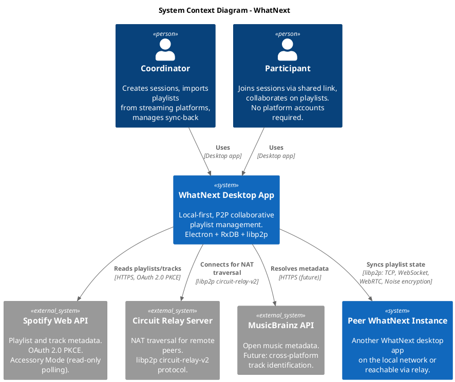
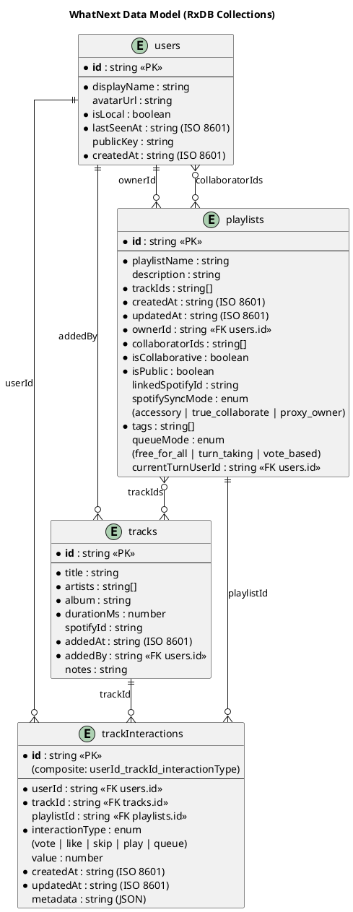

# Software Requirements Specification: WhatNext

## Changelog

| Version | Date       | Description                          | Author       |
|---------|------------|--------------------------------------|--------------|
| v0.1.0  | 2026-02-14 | MVP baseline                         | WhatNext Dev |

---

## 1. Introduction

### 1.1 Purpose

This Software Requirements Specification defines the functional and non-functional requirements for WhatNext, a resilient, user-centric music management platform. It serves as the authoritative requirements reference for development, testing, and architectural decisions throughout the MVP phase and beyond.

### 1.2 Scope

WhatNext is a cross-platform desktop application that enables collaborative playlist management through peer-to-peer networking, without requiring all participants to hold accounts on any streaming platform. The central user story driving the product is:

> "I want to be more connected with my friends, through deeper collaboration on our collaborative playlists."

The MVP delivers the **Collaborative Playlist Accessory** -- a system where one user (the Coordinator) bridges a streaming platform into a decentralized collaboration session that friends (Participants) can join with zero friction.

### 1.3 Definitions and Acronyms

| Term               | Definition |
|--------------------|------------|
| **Coordinator**    | A user who creates a session, connects to a source platform (e.g., Spotify), imports playlists, and manages sync-back to the source. |
| **Participant**    | A user who joins an existing session via a shared link. Requires no platform accounts, API keys, or OAuth flows. |
| **Session**        | A live P2P collaboration context in which peers share playlist state, track interactions, and presence information. |
| **Adapter**        | A modular integration layer that normalizes data from an external source (Spotify, MusicBrainz, local files) into the canonical format. |
| **Canonical Format** | The internal, platform-agnostic data representation used by WhatNext for tracks, playlists, and interactions. Stored as structured data in [[RxDB]] and exportable to plaintext (Markdown + YAML frontmatter). |
| **CRDT**           | Conflict-free Replicated Data Type. A data structure that supports concurrent updates without coordination. |
| **LWW**            | Last-Write-Wins. A conflict resolution strategy where the most recent write takes precedence. |
| **PKCE**           | Proof Key for Code Exchange. An OAuth 2.0 extension for public clients. |

### 1.4 References

- Technical Specification: `docs/whtnxt-nextspec.md` (source of truth)
- Coordinator Model: `docs/07 stories/the-walled-garden-cracks.md`
- Architecture Decisions: [[adr-251110-libp2p-vs-simple-peer]], [[adr-251110-electron-process-model]], [[adr-251109-database-storage-location]]
- Concept Pages: [[libp2p]], [[RxDB]], [[RxDB-Replication]], [[Circuit-Relay]], [[Handshake-Protocol]], [[Electron-IPC]], [[WebRTC]], [[Electron]]

---

## 2. Overall Description

### 2.1 Product Perspective

WhatNext occupies a unique position: it is not a streaming service, not a social network, and not a cloud application. It is a **local-first desktop tool** that treats external streaming platforms as data sources rather than dependencies. The Coordinator model (documented in `the-walled-garden-cracks.md`) defines the interaction pattern:

1. One person (Coordinator) connects to the source (e.g., Spotify).
2. They import the playlist into WhatNext, normalizing it to the canonical format.
3. They open a P2P session and share the link.
4. Friends join the session -- no accounts, no API keys, no OAuth flows.
5. Collaboration happens inside WhatNext: turn-taking, queue management, reactions.
6. Changes flow back to the source only if the Coordinator has write access and chooses to sync.

### 2.2 User Classes

| User Class      | Characteristics | Technical Requirements |
|-----------------|----------------|----------------------|
| **Coordinator** | Creates sessions, manages source platform connections, controls sync-back. Power user who bridges the walled garden. | Streaming platform account (e.g., Spotify Premium for Dev Mode), WhatNext installed. |
| **Participant** | Joins sessions, collaborates on playlists, interacts with tracks. Zero onboarding friction. | WhatNext installed. Nothing else. |

### 2.3 Operating Environment

- **Platforms**: Windows 10+, macOS 12+, Linux (Ubuntu 22.04+, Fedora 38+)
- **Runtime**: [[Electron]] (Chromium + Node.js)
- **Network**: Functional offline for local data; LAN for mDNS peer discovery; internet for relay connections and Spotify API access
- **Storage**: Local filesystem (user-accessible data directory per [[adr-251109-database-storage-location]])

### 2.4 Design Constraints

These constraints are non-negotiable architectural principles:

1. **User Sovereignty**: The local database is the absolute source of truth. External services are enhancements, never dependencies.
2. **Local-First**: All core data resides on the user's machine in a user-accessible location. The application is fully functional offline.
3. **Plaintext Storage**: All user playlists must be readable and editable as files on disk (structured Markdown with YAML frontmatter).
4. **Offline-Capable**: Core functionality (playlist viewing, editing, local playback) works without any network connection.
5. **Security Hardened**: Renderer process is sandboxed (`nodeIntegration: false`, `contextIsolation: true`). All main process communication occurs via IPC through the preload script. See [[adr-251110-electron-process-model]].
6. **Extensibility**: Architecture designed for future plugin support (inspired by Obsidian).

---

## 3. System Context

The following C4 context diagram shows WhatNext and its external dependencies.

---

## 4. Functional Requirements

### 4.1 Peer-to-Peer Networking (FR-P2P)

All P2P functionality is built on [[libp2p]] per [[adr-251110-libp2p-vs-simple-peer]]. The P2P node runs in Electron's utility process per [[adr-251110-electron-process-model]].

| ID | Requirement | Priority |
|----|-------------|----------|
| FR-P2P-001 | The system shall discover peers on the local network using mDNS with service name `_whatnext._udp.local` and a broadcast interval of 1000ms. | Must |
| FR-P2P-002 | The system shall establish direct connections to discovered peers over TCP and WebSocket transports, listening on `127.0.0.1` with OS-assigned ports. | Must |
| FR-P2P-003 | The system shall execute the [[Handshake-Protocol]] (`/whatnext/handshake/1.0.0`) upon connection, exchanging display name, application version, and capability list. | Must |
| FR-P2P-004 | The system shall support a maximum of 10 simultaneous peer connections, with a dial timeout of 30 seconds. | Must |
| FR-P2P-005 | The system shall encrypt all peer connections using the Noise protocol and multiplex streams using Yamux. | Must |
| FR-P2P-006 | The system shall connect to remote peers via [[Circuit-Relay]] servers (circuit-relay-v2) when direct connection is not possible due to NAT. | Should |
| FR-P2P-007 | The system shall support [[WebRTC]] transport for remote peer connections behind NAT. | Should |
| FR-P2P-008 | The system shall emit peer discovery and connection lifecycle events (discovered, lost, connected, disconnected, failed) to the renderer process via [[Electron-IPC]] channels (`p2p:*`). | Must |
| FR-P2P-009 | The system shall retry relay connections on failure, with a 10-second interval and a maximum of 5 retries. | Should |

### 4.2 Playlist Management (FR-PLAYLIST)

| ID | Requirement | Priority |
|----|-------------|----------|
| FR-PLAYLIST-001 | The system shall allow users to create playlists with a name, optional description, tags, and an ordered list of tracks. | Must |
| FR-PLAYLIST-002 | The system shall allow users to add, remove, and reorder tracks within a playlist. | Must |
| FR-PLAYLIST-003 | The system shall allow users to delete playlists they own. | Must |
| FR-PLAYLIST-004 | The system shall support collaborative playlists with an owner and a list of collaborator IDs. | Must |
| FR-PLAYLIST-005 | The system shall support three collaborative queue modes: `free_for_all` (any collaborator can modify freely), `turn_taking` (modifications gated by turn order, tracked via `currentTurnUserId`), and `vote_based` (modifications require vote threshold). | Must |
| FR-PLAYLIST-006 | The system shall persist all playlist data in the local [[RxDB]] database with the schema defined in `schemas.ts`. | Must |
| FR-PLAYLIST-007 | The system shall export playlists to plaintext files (Markdown with YAML frontmatter) on disk. | Must |
| FR-PLAYLIST-008 | The system shall support user-defined tags on playlists as an array of strings. | Must |

### 4.3 Import and Source Integration (FR-IMPORT)

| ID | Requirement | Priority |
|----|-------------|----------|
| FR-IMPORT-001 | The system shall authenticate with the Spotify Web API using OAuth 2.0 with PKCE, initiated only by the Coordinator. | Must |
| FR-IMPORT-002 | The system shall fetch the Coordinator's Spotify playlists using the `/me/playlists` endpoint and playlist tracks using the `/playlists/{id}/items` endpoint (updated per Spotify's February 2026 API changes). | Must |
| FR-IMPORT-003 | The system shall normalize imported Spotify tracks to the canonical `TrackDocType` format, mapping Spotify fields to: `title`, `artists[]`, `album`, `durationMs`, `spotifyId`, `addedAt`, `addedBy`. | Must |
| FR-IMPORT-004 | The system shall implement a Spotify adapter conforming to a generic adapter interface, enabling future source adapters (e.g., MusicBrainz, local files) without architectural changes. | Must |
| FR-IMPORT-005 | The system shall handle Spotify API restrictions gracefully: search results capped at 10, stripped response fields (popularity, external_ids, followers), and the 5-user Dev Mode authorization limit. | Must |
| FR-IMPORT-006 | The system shall support three Spotify sync modes as defined in the spec (section 8.1): `accessory` (read-only polling, MVP), `true_collaborate` (each user calls API), and `proxy_owner` (coordinator proxies writes). | Must (accessory); Should (others) |

### 4.4 Replication (FR-REPLICATION)

Replication synchronizes [[RxDB]] collections across peers using the `/whatnext/rxdb-replication/1.0.0` protocol. See [[RxDB-Replication]] for design details.

| ID | Requirement | Priority |
|----|-------------|----------|
| FR-REPLICATION-001 | The system shall push local document changes to connected peers, including document ID, data payload, `updatedAt` timestamp, and deletion flag. | Must |
| FR-REPLICATION-002 | The system shall pull remote document changes from connected peers using checkpoint-based synchronization (ISO timestamp of last sync). | Must |
| FR-REPLICATION-003 | The system shall resolve conflicts using Last-Write-Wins (LWW) based on the `updatedAt` timestamp, with a clear migration path to CRDTs. | Must |
| FR-REPLICATION-004 | The system shall replicate the following collections: `users`, `tracks`, `trackInteractions`, `playlists`. | Must |
| FR-REPLICATION-005 | The system shall track replication state per peer per collection, including last checkpoint and document count, and expose this state via the `replication:state` IPC channel. | Must |
| FR-REPLICATION-006 | The system shall report replication state as one of: `idle`, `pulling`, `pushing`, or `error`. | Must |

### 4.5 Session Management (FR-SESSION)

| ID | Requirement | Priority |
|----|-------------|----------|
| FR-SESSION-001 | The Coordinator shall be able to create a new collaboration session, generating a shareable session link. | Must |
| FR-SESSION-002 | Participants shall be able to join a session via the shared link with zero additional setup (no accounts, no API keys, no OAuth). | Must |
| FR-SESSION-003 | The system shall display real-time presence information for all peers in the current session, including display name and connection status. | Must |
| FR-SESSION-004 | The system shall track user identity via the `users` collection, distinguishing the local user (`isLocal: true`) from remote peers. | Must |
| FR-SESSION-005 | The system shall support track interactions (vote, like, skip, play, queue) scoped to a user, track, and optionally a playlist, stored in the `trackInteractions` collection. | Must |
| FR-SESSION-006 | The system shall update `lastSeenAt` for connected peers to reflect activity. | Must |

---

## 5. Non-Functional Requirements

### 5.1 Performance

| ID | Requirement | Target |
|----|-------------|--------|
| NFR-PERF-001 | P2P message latency on local network (mDNS peers) | < 500ms round-trip |
| NFR-PERF-002 | P2P message latency via circuit relay | < 2000ms round-trip |
| NFR-PERF-003 | Peer discovery to connection-ready on LAN | < 5 seconds |
| NFR-PERF-004 | Spotify playlist import (100 tracks) | < 10 seconds |
| NFR-PERF-005 | Application cold start to interactive | < 3 seconds |
| NFR-PERF-006 | RxDB reactive query update propagation to UI | < 100ms |

### 5.2 Security

| ID | Requirement |
|----|-------------|
| NFR-SEC-001 | All P2P connections shall be encrypted using the Noise protocol framework. |
| NFR-SEC-002 | The Electron renderer process shall run with `nodeIntegration: false` and `contextIsolation: true`. No direct Node.js access in the renderer. |
| NFR-SEC-003 | All main process communication from the renderer shall pass through the preload script via `contextBridge`. |
| NFR-SEC-004 | Spotify OAuth shall use PKCE (no client secret in the desktop application). |
| NFR-SEC-005 | External links shall open in the system browser, never in an in-app window. |
| NFR-SEC-006 | OAuth tokens shall be stored securely and never transmitted to peers. |

### 5.3 Usability

| ID | Requirement |
|----|-------------|
| NFR-USE-001 | Participants shall be able to join a session with a single action (clicking a link or pasting a code). No account creation, no OAuth, no API keys. |
| NFR-USE-002 | The Coordinator's Spotify connection flow shall complete in 3 steps or fewer (initiate, authorize in browser, return to app). |
| NFR-USE-003 | Peer connection status shall be clearly visible in the UI at all times during an active session. |

### 5.4 Reliability

| ID | Requirement |
|----|-------------|
| NFR-REL-001 | The application shall be fully functional offline for all local operations (viewing, editing, and creating playlists). |
| NFR-REL-002 | The [[RxDB]] database shall be crash-resilient; data shall survive unexpected application termination. |
| NFR-REL-003 | Loss of a peer connection shall not corrupt local data. Partial replication shall be recoverable via checkpoint-based sync on reconnection. |
| NFR-REL-004 | The P2P node shall recover gracefully from network interface changes (e.g., Wi-Fi reconnect). |

---

## 6. User Stories

### US-001: Import a Spotify Playlist
**As a** Coordinator, **I want to** import one of my Spotify playlists into WhatNext **so that** I can share it with friends who do not have Spotify.

**Acceptance Criteria:**
- Coordinator authenticates with Spotify via OAuth PKCE.
- Coordinator selects a playlist from their Spotify library.
- Tracks are normalized to canonical format and stored in local RxDB.
- Imported playlist displays in WhatNext with all track metadata.

### US-002: Create and Share a Session
**As a** Coordinator, **I want to** create a collaboration session and share a link **so that** my friends can join without any setup.

**Acceptance Criteria:**
- Coordinator creates a session from an imported or local playlist.
- System generates a shareable link or code.
- Link can be distributed via any messaging platform.

### US-003: Join a Session
**As a** Participant, **I want to** join a friend's session by clicking a link **so that** I can collaborate on their playlist instantly.

**Acceptance Criteria:**
- Clicking the link opens WhatNext (or prompts installation).
- P2P connection establishes automatically.
- Handshake completes and playlist state replicates.
- Participant sees the shared playlist within 5 seconds on LAN.

### US-004: Collaborate on a Playlist
**As a** Participant, **I want to** add tracks, vote on tracks, and react to the playlist **so that** I feel connected to the collaborative experience.

**Acceptance Criteria:**
- Participant can add tracks to the shared playlist.
- Participant can vote, like, or skip tracks.
- Interactions are visible to all peers in real time.
- Queue mode rules are enforced (turn-taking, free-for-all, or vote-based).

### US-005: Work Offline
**As a** user, **I want to** view and edit my playlists without an internet connection **so that** my music library is always accessible.

**Acceptance Criteria:**
- All playlists and tracks are available offline.
- Edits made offline are persisted locally.
- On reconnection, changes sync to peers via checkpoint-based replication.

### US-006: Sync Changes Back to Spotify
**As a** Coordinator, **I want to** optionally push collaborative changes back to the Spotify playlist **so that** the collaboration results are reflected on the streaming platform.

**Acceptance Criteria:**
- Coordinator can view a diff of changes since last sync.
- Sync-back is explicitly initiated (never automatic).
- Only the Coordinator can trigger sync-back.
- Failures are reported clearly; local data is never lost.

### US-007: Discover Peers on Local Network
**As a** user, **I want to** automatically discover other WhatNext users on my local network **so that** I can connect without manually entering addresses.

**Acceptance Criteria:**
- Peers running WhatNext on the same LAN appear within 5 seconds.
- Discovered peers show display name and connection status.
- User can initiate a connection to a discovered peer.

### US-008: Export Playlist to Plaintext
**As a** user, **I want to** export my playlist as a readable Markdown file **so that** I own my data in a format that outlasts any application.

**Acceptance Criteria:**
- Export produces a Markdown file with YAML frontmatter.
- File contains all track metadata, tags, and descriptions.
- File is human-readable and editable with any text editor.

---

## 7. Data Model

The following entity-relationship diagram reflects the [[RxDB]] schema defined in `app/src/renderer/db/schemas.ts`.

---

## 8. External Interfaces

### 8.1 Spotify Web API

**Purpose**: Playlist import and track metadata retrieval (Coordinator only).

**Authentication**: OAuth 2.0 with PKCE. No client secret stored in the application. Tokens stored locally and never shared with peers.

**February 2026 API Changes** (impact on WhatNext):

| Change | Impact | Mitigation |
|--------|--------|------------|
| Premium required for Dev Mode | Coordinator must have Spotify Premium | Documented as Coordinator prerequisite |
| 1 Client ID per developer, 5 authorized users (down from 25) | Limits the number of Coordinators using a single WhatNext build's Client ID | Adapter architecture allows community-provided Client IDs; Participant model eliminates need for most users to authenticate |
| 16 endpoints removed (artist top tracks, multi-gets, user profiles, etc.) | No direct impact on MVP (import flow uses playlist and track endpoints) | Core import flow (`/me/playlists`, `/playlists/{id}/items`) remains functional |
| Response fields stripped (popularity, external_ids, followers) | Reduced metadata richness | Canonical format does not depend on stripped fields |
| Search max results reduced to 10 (was 50) | Limited search-based track discovery | Pagination or alternative sources (MusicBrainz) for future phases |
| `/playlists/{id}/tracks` renamed to `/playlists/{id}/items` | Endpoint path change | Updated in adapter implementation |

**Key Endpoints Used**:
- `GET /me/playlists` -- List Coordinator's playlists
- `GET /playlists/{id}/items` -- Fetch tracks for a specific playlist
- `GET /me` -- Verify authentication status

**IPC Channels**: `spotify:auth-start`, `spotify:auth-status`, `spotify:get-playlists`, `spotify:get-tracks`

### 8.2 libp2p / Circuit Relay

**Purpose**: NAT traversal for peers that cannot establish direct connections.

**Protocol**: libp2p circuit-relay-v2 (see [[Circuit-Relay]]).

**Configuration**: Relay addresses configured in `P2P_CONFIG.RELAY.ADDRESSES`. Auto-connect on startup with retry (10s interval, max 5 retries).

**Transports**: TCP (localhost), WebSocket (localhost), WebRTC (remote), Circuit Relay (remote).

**Encryption**: Noise protocol. **Multiplexing**: Yamux.

### 8.3 MusicBrainz API (Future)

**Purpose**: Open, platform-agnostic music metadata for cross-platform track identification and enrichment.

**Status**: Not implemented in MVP. Planned for Phase 2+ as an additional adapter.

---

## 9. Assumptions and Dependencies

### 9.1 Assumptions

1. Users have a desktop computer running a supported operating system (Windows 10+, macOS 12+, or a recent Linux distribution).
2. For Coordinator functionality, the user has a Spotify Premium account (required for Dev Mode as of February 2026).
3. For LAN peer discovery, peers are on the same local network segment with mDNS traffic permitted.
4. For remote peer connections, at least one circuit relay server is available and configured.

### 9.2 Dependencies

| Dependency | Version | Purpose |
|------------|---------|---------|
| Electron   | Latest stable | Desktop runtime (Chromium + Node.js). See [[Electron]]. |
| Node.js    | v24.3.0 | Runtime for main and utility processes |
| React      | 19.x | UI framework for renderer process |
| TypeScript | 5.x | Type safety across all process boundaries |
| RxDB       | Latest stable | Reactive local database with replication support. See [[RxDB]]. |
| libp2p     | Latest stable | P2P networking stack (transport, discovery, encryption). See [[libp2p]]. |
| Vite       | Latest stable | Build tool and dev server for renderer |
| Zustand    | Latest stable | Lightweight state management for non-persistent UI state |
| Tailwind CSS | 4.x | Utility-first CSS framework |

### 9.3 Risks

| Risk | Likelihood | Impact | Mitigation |
|------|------------|--------|------------|
| Spotify further restricts API access | Medium | High | Adapter architecture isolates Spotify dependency; Coordinator model limits blast radius to one user per session |
| libp2p browser/Electron compatibility issues | Medium | Medium | Utility process isolation (see [[adr-251110-electron-process-model]]); test-peer harness for rapid iteration |
| LWW conflict resolution causes data loss | Low | Medium | Clear migration path to CRDTs; `updatedAt` timestamps on all mutable documents |
| NAT traversal failures prevent remote connections | Medium | Medium | Multiple transport fallbacks (TCP, WebSocket, WebRTC, Circuit Relay); relay retry logic |
